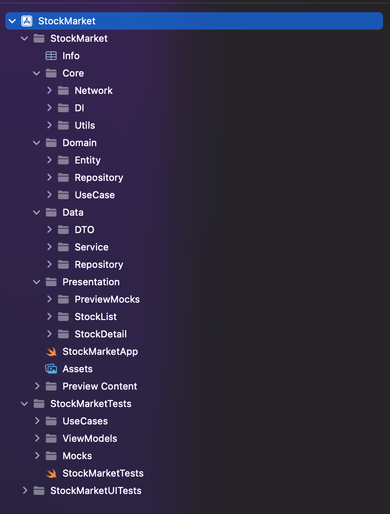

# Stock Market iOS App

---

## Overview

This application displays a list of stocks with real-time updates and allows users to view detailed information for each stock.

The project is built using **SwiftUI + Clean Architecture + MVVM**, focusing on scalability, testability, and separation of concerns.

---

## Architecture

The app follows **Clean Architecture layered with MVVM**.

### Presentation Layer

* SwiftUI Views
* ViewModels (`ObservableObject`)
* Handles UI state (loading, error, data)

### Domain Layer

* Entities (`Stock`, `StockDetail`)
* UseCases (`GetStocksUseCase`, `GetStockDetailUseCase`)
* Repository Protocols

### Data Layer

* Repository Implementation
* API Services
* DTOs (Decodable models)

### Core Layer

* Network Layer (`URLSession`-based client)
* Dependency Injection (`AppContainer`)

---

## Data Flow

View → ViewModel → UseCase → Repository → Service → Network → API

* View triggers actions
* ViewModel manages UI state
* UseCase encapsulates business logic
* Repository handles data transformation
* Service interacts with API
* Network layer executes requests

---

## Tech Stack

* SwiftUI
* Swift Concurrency (`async/await`)
* URLSession
* XCTest

---

## Features

* Stock list with price and change %
* Search functionality
* Auto-refresh every 8 seconds
* Stock detail screen
* Error and loading state handling

---

## Testing Strategy

Unit tests focus on:

* ViewModel logic (state updates, filtering, error handling)
* UseCase execution
* Mock Repository for isolation

### Tested Components

* StockListViewModel
* StockDetailViewModel
* GetStocksUseCase
* GetStockDetailUseCase

---

## Notes

* `stock/v2/get-summary` is deprecated
* Used `stock/v2/get-quote` for detail screen
* DTOs are adjusted based on actual API response structure

---

## Demo Video

[Watch Demo Video](https://drive.google.com/file/d/1mkEjza68H-aLvx-x7KON71QAJHqUi9bT/view?usp=sharing)

---

## Architecture Diagram

